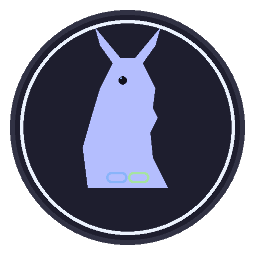

<!-- codex-branding:start -->
<p align="center"></p>

<p align="center">
  
  
  
</p>
<!-- codex-branding:end -->

<p align="center">
  
</p>

<h1 align="center">LlamaLink</h1>

<p align="center">
  <strong>A sleek GUI frontend for llama.cpp</strong><br>
  Search, download, and chat with local LLMs in one app.
</p>

<p align="center">
  
  
  
  
  
</p>

---

## Features

**Model Management**
- Browse and download GGUF models directly from HuggingFace
- Sort by downloads, likes, date, or trending
- View available quantizations (Q4_K_M, Q8_0, IQ3_S, etc.) with file sizes
- Download with progress bar, speed display, ETA, and resume support
- Recursive model folder scanning with automatic detection

**Server Control**
- Launch and manage llama-server with full parameter control
- Or connect to an already-running server (any OpenAI-compatible endpoint)
- Auto-detect llama-server from PATH and common install locations
- Context size, GPU layers, threads, flash attention, mlock toggles
- Embedded server log viewer

**Chat Interface**
- Streaming responses with live token-by-token display
- Markdown rendering: code blocks, inline code, bold, italic
- Tokens/sec speed display during and after generation
- System prompt support
- Parameter presets: Default, Creative, Precise, Code, Roleplay
- Adjustable temperature, top_p, top_k, repeat penalty, max tokens

**Chat History**
- Auto-saves conversations locally
- Load, export (Markdown / JSON / Text), and delete past chats

**Design**
- Catppuccin Mocha dark theme throughout
- Responsive split-panel layout
- Window position and all settings persist between sessions

## Installation

### Portable EXE (Recommended)

Download `LlamaLink.exe` from [Releases](https://github.com/SysAdminDoc/LlamaLink/releases) and run it. No installation required.

### From Source

```bash
git clone https://github.com/SysAdminDoc/LlamaLink.git
cd LlamaLink
python llamalink.py
```

Dependencies (`PyQt6`, `requests`) are auto-installed on first run.

## Quick Start

1. **Download a model** - Go to the "Download Models" tab, search for a model (e.g. `llama`, `qwen`, `mistral`), pick a quant, and download it
2. **Set server path** - Browse to your `llama-server.exe` (auto-detected if on PATH)
3. **Select model** - Your downloaded model appears automatically in the dropdown
4. **Start server** - Click "Start Server" and wait for the "Running" indicator
5. **Chat** - Switch to the Chat tab and start talking

### Connecting to an Existing Server

Uncheck "Launch server", enter the URL (e.g. `http://127.0.0.1:8080`), and click Connect. Works with any OpenAI-compatible API endpoint.

## Requirements

- **llama.cpp** - Download from [llama.cpp releases](https://github.com/ggerganov/llama.cpp/releases)
- **Python 3.8+** (if running from source)
- **NVIDIA GPU** recommended (auto-detected, CPU-only works too)

## HuggingFace Token

Public models work without authentication. For gated/private models, set the `HF_TOKEN` environment variable:

```bash
set HF_TOKEN=hf_your_token_here
python llamalink.py
```

## Building from Source

```bash
pip install pyinstaller
pyinstaller llamalink.spec
```

The executable will be in `dist/LlamaLink.exe`.

## License

MIT
